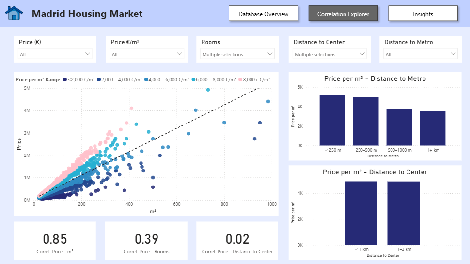

# 🏙️ Madrid Housing Market Analysis

Interactive analysis of over 75,000 housing assets in Madrid, focused on uncovering the relationships between price, location, and property characteristics.
Built using SQL Server for data processing and Power BI for visualization.

🔗 

## 📊 Dashboard

Database Overview: 

Correlation Explorer – Key drivers of price (surface, rooms, distance, amenities)

Insights – Summary of findings and price elasticity visualization

## 💡 Insights

- Prices drop sharply as the distance to the city center increases.
- Surface and number of rooms are the strongest positive drivers.
- Buildings closer to the city center are older.
- Central small flats show the highest price per m² premiums.
- Lift has a higher impact on price than Parking or Pool.

## ⚙️ Tools Used

SQL Server (SSMS): Data cleaning, deduplication, and mapping.

Power BI: DAX modeling, correlations, KPI dashboards.

Excel / CSV: Initial data management.
